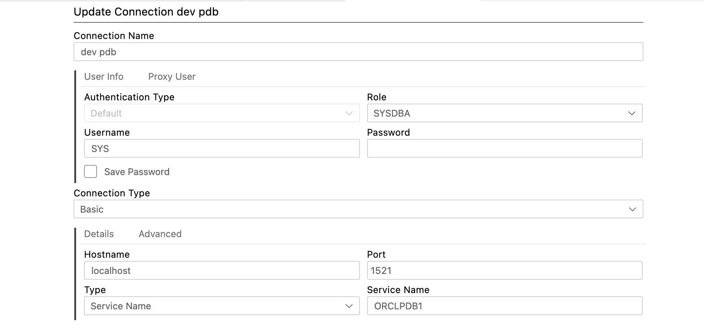

1.	clone this: https://github.com/oracle/docker-images#
2.	cd into /OracleDatabase/SingleInstance/dockerfiles/19.3.0
3.	download the ARM zipfile from https://www.oracle.com/uk/database/technologies/oracle-database-software-downloads.html and add it (without unzip) into the folder from step 2
4.	cd into /OracleDatabase/SingleInstance/dockerfiles && ./buildContainerImage.sh -v 19.3.0 -e
5.	docker run -d --name oracle19 -e ORACLE_PWD=mypassword1 -p 1521:1521 oracle/database:19.3.0-ee
6.	connect with the attached connection details in oracle developer in vscode

